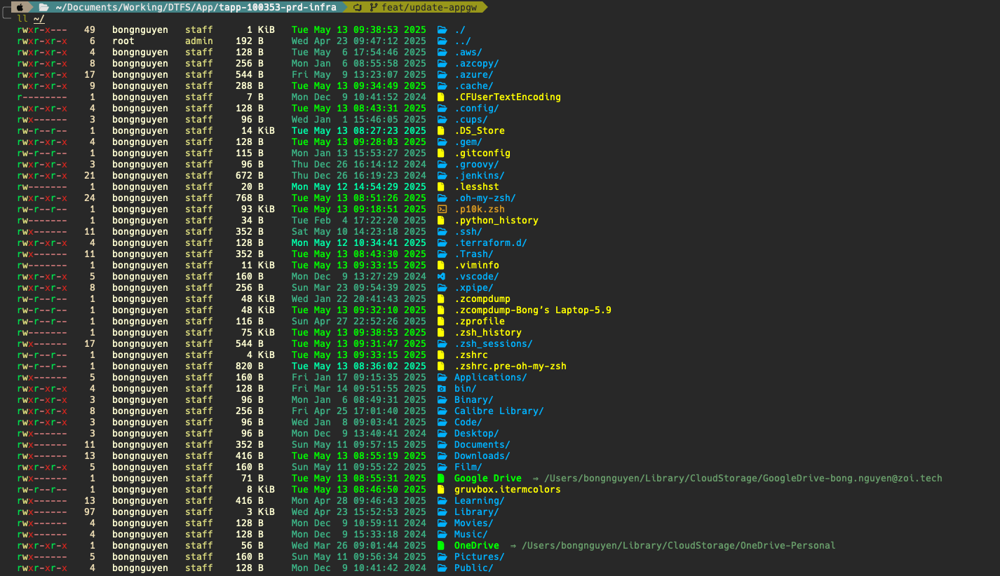

# Beautiful Your MacoS Terminal

## Step 1 - Install Item2: 
- Download from here: https://iterm2.com/
- Install on your mac

## Step 2 - Install GruvboxDark theme
- Download from here: https://iterm2colorschemes.com
- Create a file name `gruvbox.itermcolors` and past code of them to it.
- Go to `iTerm2 > Settings > Profiles > Default > Colors > Color Preset > Import ...`
- Go to `iTerm2 > Settings > Profiles > Default > Colors > Color Preset > grovbox`

- G

## Step 3 - Instal ohmyzsh: 
`sh -c "$(curl -fsSL https://raw.githubusercontent.com/ohmyzsh/ohmyzsh/master/tools/install.sh)"`

## Step 4 - Install new font:
- Download Fonts: https://www.nerdfonts.com/font-downloads => Hack Nerd Font
- Extract zip folder
- Install them by click on it `HackNerdFont-Regular.ttf` for example
- Go to `iTerm2 > Settings > Profiles > Default > Text > Font > Hack Nerd Font `

Step 5 - Install Power10K
Download: `git clone --depth=1 https://github.com/romkatv/powerlevel10k.git "${ZSH_CUSTOM:-$HOME/.oh-my-zsh/custom}/themes/powerlevel10k"`

Edit `ZSH_THEME` in `/.zshrc`:

`ZSH_THEME="powerlevel10k/powerlevel10k"`

Setup by run `source ~/.zshrc`

## Step 6 - Install zsh syntax highlighting:
```zsh
git clone https://github.com/zsh-users/zsh-syntax-highlighting.git ${ZSH_CUSTOM:-~/.oh-my-zsh/custom}/plugins/zsh-syntax-highlighting
```
Activate the plugin in ~/.zshrc:
```zsh
plugins=( [plugins...] zsh-syntax-highlighting)
```

## Step 7 - Install zsh autosuggestions

`git clone https://github.com/zsh-users/zsh-autosuggestions ${ZSH_CUSTOM:-~/.oh-my-zsh/custom}/plugins/zsh-autosuggestions`

Add the plugin to the list of plugins for Oh My Zsh to load (inside ~/.zshrc):
```zsh
plugins=( [plugins...] zsh-autosuggestions)
```

## Step 8 - Install Colorls
```zsh
sudo gem install colorls
```

## Result


Ref: [How to setup your Mac Terminal to be beautiful](https://www.youtube.com/watch?v=wNQpDWLs4To)
